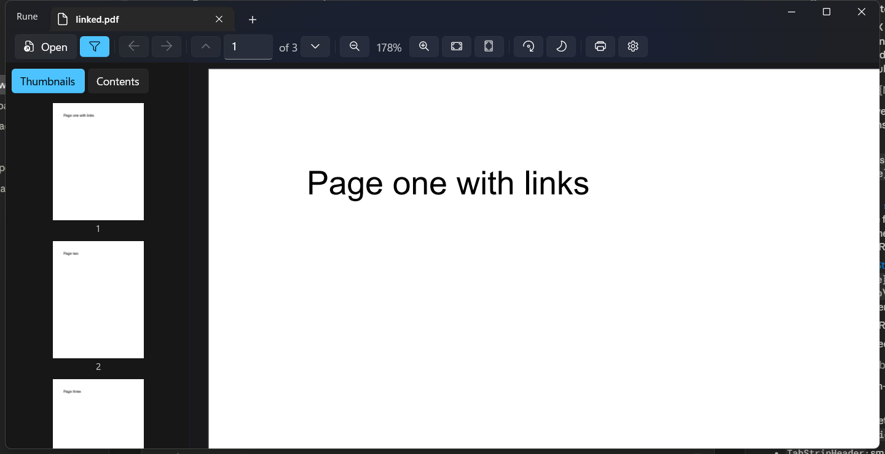
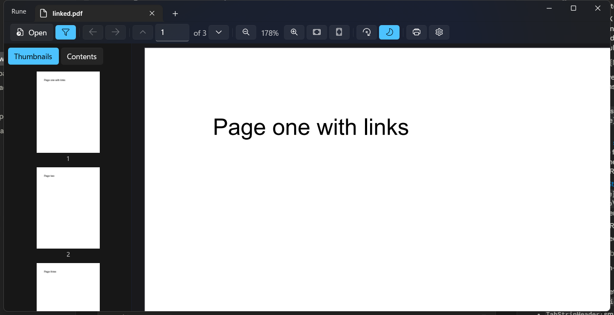

<div align="center">

# ᚱ Rune

**A fast, free, modern PDF reader for Windows.**

[](https://github.com/DanialJaved/rune/actions/workflows/ci.yml)
[](LICENSE)
[](https://github.com/DanialJaved/rune/releases)

</div>

Windows never had a PDF reader that is fast **and** lightweight **and** modern-looking at the same time. SumatraPDF is legendary for speed but wears a 2009 UI; Edge and Acrobat are heavy; Okular's Windows port doesn't feel native. Rune combines:

- the **speed** of SumatraPDF / Zathura — instant open, smooth scrolling through 1,000-page documents, strict memory budget
- the **look and feel of GNOME Papers** — a slim single header bar, a floating zoom control, a big-thumbnail sidebar — rebuilt natively on Windows 11 (Mica, dark mode, tabs in the title bar)
- a **keyboard-first** workflow — command palette, full arrow/vim navigation, a shortcuts overlay (`F1`), every action reachable without the mouse

| Dark | Night mode (inverted pages) |
|---|---|
|  |  |

## Features

- Tabs in the title bar (Chrome-style), lazy-loaded — background tabs cost nothing until shown
- Continuous virtualized scrolling with tile-based progressive rendering (blurry-fast → crisp), rock-steady even while searching and scrolling a 1,000-page document at once
- Zoom 10–640% at the cursor from a floating zoom pill, fit-width / fit-page, rotation
- **Sidebar** (open by default, `F9`) with a switcher for **thumbnails / chapters / bookmarks**; internal & web links; back/forward history
- Full keyboard navigation — arrows scroll and page, `PageUp`/`PageDown`, `Home`/`End` (plus optional vim keys)
- Text selection & copy, find-in-document with highlight-all and hit stepping
- **Annotations**: highlight, underline, strikeout from a selection, sticky notes, and **freehand pen/ink** — saved as standard PDF annotations any reader can see (`Ctrl+H` highlight, `Ctrl+E` pen, right-click menu, `Ctrl+S` / `Ctrl+Shift+S`)
- **Page editing** in the thumbnail sidebar: multi-select, drag to reorder, `Delete`, copy/cut/paste pages (`Ctrl+C`/`X`/`V`, works across open tabs), or drop a PDF onto the sidebar to insert its pages
- **Undo / redo** for annotations and page edits (`Ctrl+Z` / `Ctrl+Y`)
- **Bookmarks** (`Ctrl+B`): name a page and jump back later; saved per document
- **Presentation mode** (`F5`): fullscreen, one page at a time, arrows / space / click to advance
- **Keyboard shortcuts overlay** (`F1`)
- **Night mode**: GPU-inverted page colors for dark-room reading (`Ctrl+I`)
- **Recent-documents homepage**: a clean grid of first-page thumbnails of your last files
- Command palette (`Ctrl+K`) with fuzzy filtering and go-to-page
- Session restore: reopens your tabs at the exact scroll position
- Pinch-to-zoom (touch/touchpad) and `Ctrl`+scroll, zoom at the cursor
- **Self-updating**: checks GitHub for new releases and updates in place (portable build; toggle in Settings)
- Printing with live preview and page ranges
- Opens damaged PDFs gracefully; 4 GB-file streaming without loading into memory

The interface follows GNOME Papers' proportions — one compact header row, with the rest tucked into a single menu — but is built entirely from native Windows 11 controls.

## Keyboard shortcuts

Press `F1` in the app for the full list. The essentials:

| Action | Keys |
|---|---|
| Open / close tab | `Ctrl+O` / `Ctrl+W` |
| Scroll / screen up-down | `↑` `↓` / `PgUp` `PgDn`, `Space` |
| Previous / next page | `←` / `→` |
| First / last page | `Home` / `End` |
| Find / next / previous | `Ctrl+F` / `F3` / `Shift+F3` |
| Command palette / shortcuts | `Ctrl+K` / `F1` |
| Zoom in / out / 100% / fit page / fit width | `Ctrl++` / `Ctrl+-` / `Ctrl+1` / `Ctrl+0` / `Ctrl+2` |
| Night mode / sidebar / rotate | `Ctrl+I` / `F9` / `Ctrl+R` |
| Presentation / bookmark page | `F5` / `Ctrl+B` |
| Highlight / pen / save / save as | `Ctrl+H` / `Ctrl+E` / `Ctrl+S` / `Ctrl+Shift+S` |
| Copy / cut / paste (text or pages) | `Ctrl+C` / `Ctrl+X` / `Ctrl+V` |
| Undo / redo | `Ctrl+Z` / `Ctrl+Y` |
| Print / properties | `Ctrl+P` / `Ctrl+D` |

Vim-style keys (`j k h l`, `gg`/`G`, `p`/`n`) can be enabled in Settings. Right-click a selection for underline/strikeout, or anywhere to add a note. Pen color and width are in the menu. In the thumbnail sidebar, `Ctrl+C`/`X`/`V` copy/cut/paste **pages**; elsewhere they act on selected text.

## Install

**Portable (recommended):** grab `rune-vX.Y.Z-win-x64.zip` from [Releases](https://github.com/DanialJaved/rune/releases), extract anywhere, run `Rune.exe`. No installation, no registry.

**MSIX (for "default PDF app" integration):** download the `.msix` and `rune-signing.cer` from Releases, then trust the certificate once (admin PowerShell):

```powershell
Import-Certificate -FilePath rune-signing.cer -CertStoreLocation Cert:\LocalMachine\TrustedPeople
Add-AppxPackage -Path Rune.App_x.y.z.0_x64.msix
```

Then set Rune as your default PDF handler in Settings → Apps → Default apps. (A store-signed package is planned so this step disappears.)

> **Smart App Control / SmartScreen:** Rune is not yet code-signed, so machines with Smart App Control enabled will block it, and SmartScreen may warn on first run ("More info → Run anyway"). Code signing that satisfies SAC is planned. Until then, the portable build on a machine with SAC **off** is the smoothest path.
>
> Packages aren't size-optimized yet — the zip carries the full self-contained .NET + Windows App SDK runtimes.

## Tech

| Layer | Choice |
|---|---|
| UI | WinUI 3 (Windows App SDK 2.x), C# / .NET 10 |
| PDF engine | [PDFium](https://pdfium.googlesource.com/pdfium/) (Chrome's renderer, BSD-3-Clause/Apache-2.0) via [bblanchon/pdfium-binaries](https://github.com/bblanchon/pdfium-binaries) |
| Rendering | Win2D virtualized canvas ← LRU tile cache ← single render thread (PDFium is not thread-safe) ← thin P/Invoke |

```
src/
  Rune.App/            WinUI 3 shell: tabs, viewer control, palette, print
  Rune.Engine/         document services, render scheduler, layout, search, state
  Rune.PdfiumInterop/  P/Invoke bindings over pdfium.dll
tests/
  Rune.Tests/          xUnit suite against a generated PDF corpus
```

## Building

.NET 10 SDK on Windows — no Visual Studio required:

```
dotnet build src/Rune.App/Rune.App.csproj -p:Platform=x64
dotnet test tests/Rune.Tests/Rune.Tests.csproj
```

The debug build is an unpackaged self-contained exe — just run it.

## Roadmap

**Next:** form filling, digital signature verification, page extraction to a new file, more formats (ePub, CBZ), code signing, smaller packages.

## License

[GPLv3](LICENSE) — free forever, and derivatives stay free. Built on PDFium (BSD-3-Clause/Apache-2.0), Win2D (MIT), the Windows App SDK, and .NET (MIT); see [THIRD-PARTY-NOTICES.md](THIRD-PARTY-NOTICES.md).
