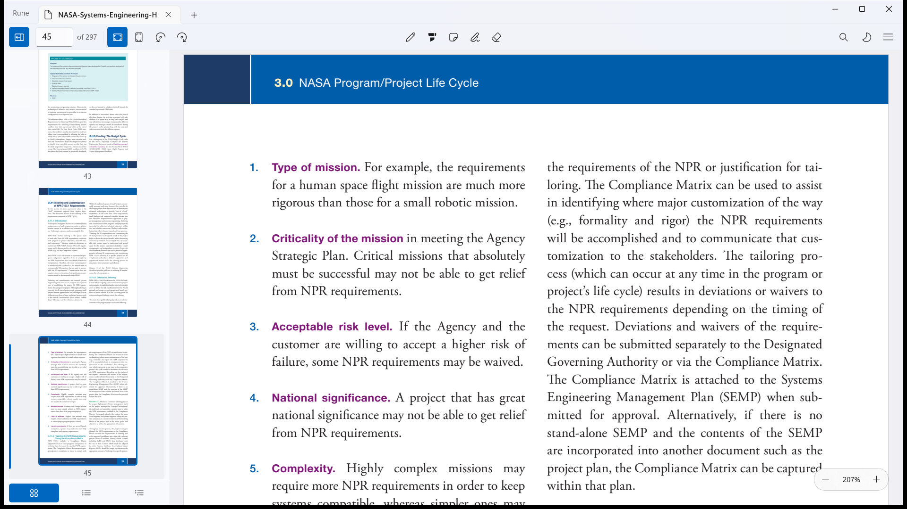
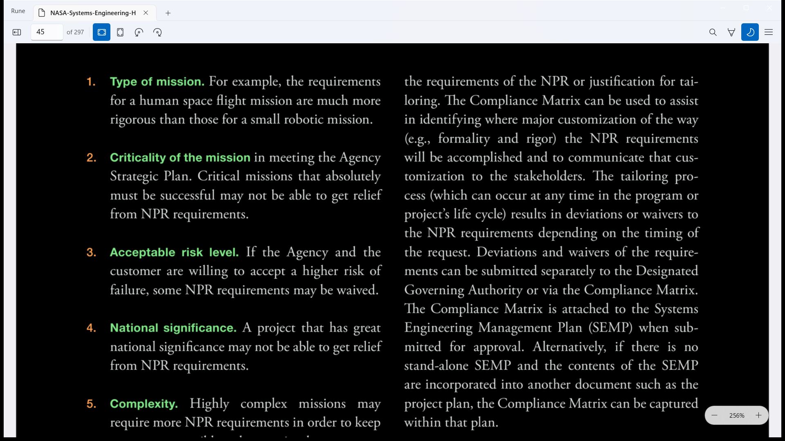
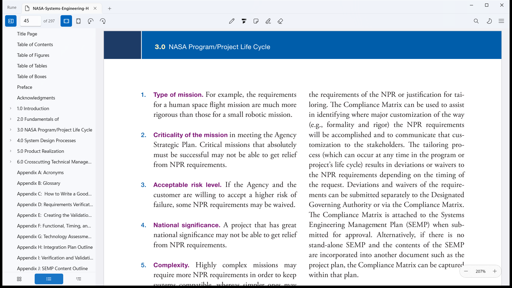
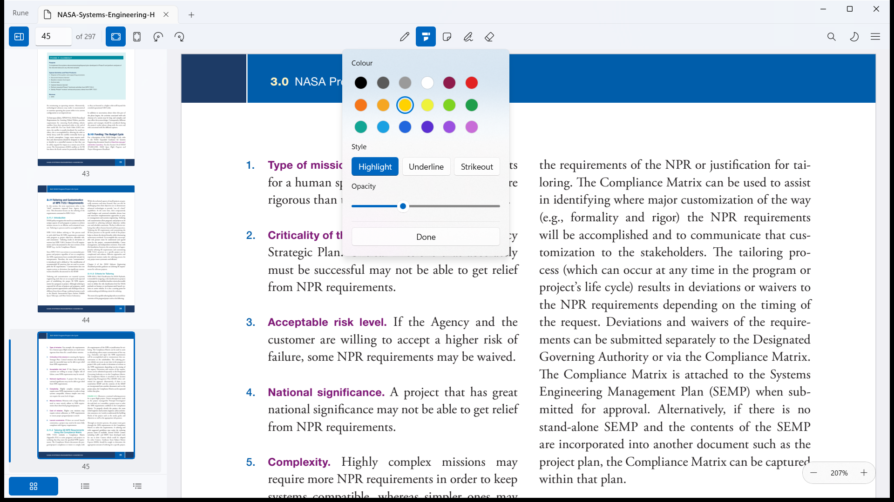
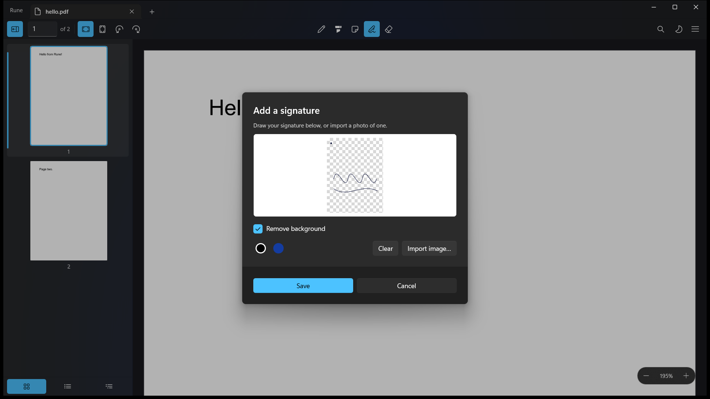

<div align="center">


# Rune

**A fast, free, modern PDF reader for Windows.**

<a href="https://apps.microsoft.com/detail/9NH37840QDM6">
  <picture>
    <source media="(prefers-color-scheme: dark)" srcset="https://get.microsoft.com/images/en-us%20dark.svg">
    
  </picture>
</a>

[](https://github.com/DanialJaved/rune/actions/workflows/ci.yml)
[](LICENSE)



</div>

Windows never had a PDF reader that is fast **and** lightweight **and** modern-looking at the same time. SumatraPDF is legendary for speed but wears a 2009 UI. Edge and Acrobat are heavy. Okular's Windows port never quite feels native. Rune takes:

- the **speed** of SumatraPDF and Zathura: instant open, smooth scrolling through 1,000-page documents, a strict memory budget
- the **look of GNOME Papers**: one slim header bar, a floating zoom control, a big-thumbnail sidebar, rebuilt natively on Windows 11 with Mica, dark mode and tabs in the title bar
- a **keyboard-first** workflow: a command palette, full arrow and vim navigation, a shortcuts overlay (`F1`), every action reachable without the mouse

No account, no subscription, no telemetry, no ads. Rune contains no networking code at all.

|  |  |
|---|---|
| <br>**Night mode** inverts page colours on the GPU, thumbnails included. | <br>**Chapters** from the document outline, alongside thumbnails and your own bookmarks. |
| <br>**One toolbar for markup.** Pick a tool and its colours, size and opacity open beneath it. | <br>**Photograph a signature** on paper and Rune keys the paper out for you, on your machine. |

## Features

### Reading

- Tabs in the title bar, Chrome-style and lazy-loaded, so background tabs cost nothing until you show them
- Continuous virtualized scrolling with tile-based progressive rendering: a fast blurry pass first, then a crisp one. It stays steady even while you search and scroll a 1,000-page document at once
- Zoom 10–640% at the cursor from a floating pill, plus fit-width, fit-page and rotation. Pinch to zoom on touch and touchpad, `Ctrl` + scroll everywhere else
- Sidebar (`F9`, open by default) that switches between thumbnails, chapters and bookmarks
- Internal and web links, with back and forward history (`Alt` + arrows)
- Text selection and copy, plus find-in-document with highlight-all and hit stepping
- Night mode (`Ctrl+I`) for reading in the dark, and presentation mode (`F5`) for showing a document fullscreen
- A recent-documents homepage laid out as first-page thumbnails, and session restore that reopens your tabs at the exact scroll position
- Opens damaged PDFs gracefully, and streams 4 GB files without loading them into memory

### Markup

- Highlight, underline, strikeout, sticky notes and freehand pen, all written as standard PDF annotations that any reader can open
- Pen, highlighter, note, text, picture, sign and eraser sit together in the middle of the header. Pick one and its colours, size and opacity open right beneath it
- The highlighter works in a single gesture: drag across the text. It still writes real markup, so highlights stay attached to the words rather than floating over them
- Undo and redo (`Ctrl+Z` / `Ctrl+Y`) across annotations and page edits alike
- Flatten bakes annotations and filled fields into the page so they can't be edited back out

### Typing and pictures

- **Type anywhere on a page** (`Ctrl+T`), whether or not there is anything there already: click, and a caret appears with a bar offering font, size, bold, italic and colour. Every change lands on the words as you make it
- What you type is **real PDF text**, not a picture of text. It stays crisp at any zoom, it is a few hundred bytes rather than a bitmap, and once flattened it is ordinary page text that search and copy find like any other
- **Place a picture** on a page from any PNG, JPEG, BMP, GIF or TIFF. Transparency is kept, and nothing is keyed out: a picture you chose deliberately lands exactly as it is
- Anything you place can be picked up again. Click it to select, drag to move, pull a corner to resize, `Delete` to remove. Resizing text **re-renders it at the new size** rather than stretching the letters, which is the point of keeping it as text

### Signing

- Draw a signature with the mouse or a pen, type it in a handwriting face, or photograph one on paper and import it. **Rune removes the paper for you**, so only the ink lands on the page instead of a white rectangle over your document
- Typed signatures use the handwriting fonts Windows already has, so nothing extra is downloaded and the app stays small
- The matting runs entirely on your machine. Nothing is uploaded and no online service is involved
- A semi-transparent preview follows the cursor so you can see exactly where it will land. Scroll to size it, click to place it, then drag it or pull a corner handle if it isn't quite right. Resizing keeps the proportions, so your handwriting never comes out stretched
- Saved signatures are reusable and stay on your machine
- This is a *visible* signature, ink on the page like signing a printout, not a cryptographic one
- **Signature details** reads back what a digitally signed PDF claims: the signer's stated reason, time and format, and whether the signature covers the whole file. Rune does **not** verify signatures. It ships no cryptography and never calls a signature valid

### Forms

- Click a field and type. Text boxes, dropdowns, checkboxes and radio buttons all save back into the PDF
- Right-click a field for **Text appearance** to set the size and colour it fills in with, so your answers can stand apart from the printed form
- Standard AcroForm documents only. XFA forms, which some tax and government PDFs use, say so plainly instead of silently swallowing your typing
- Form JavaScript doesn't run, so auto-calculating fields keep what you type but won't recalculate

### Pages and keyboard

- Page editing in the thumbnail sidebar: multi-select, drag to reorder, `Delete`, and copy, cut and paste pages across open tabs. Drop a PDF onto the sidebar to insert its pages
- Extract the pages you have selected to a new file, leaving the document you are reading untouched
- Command palette (`Ctrl+K`) with fuzzy filtering and go-to-page
- Shortcuts overlay (`F1`) listing every binding in two columns
- Bookmarks (`Ctrl+B`): name a page, jump back to it later, saved per document
- Vim-style keys (`j k h l`, `gg` / `G`, `p` / `n`) can be switched on in Settings
- Printing with live preview and page ranges

The interface follows GNOME Papers' proportions, one compact header row with the rest tucked into a single menu, but every control is a native Windows 11 one.

## Keyboard shortcuts

Press `F1` in the app for the full list. The essentials:

| Action | Keys |
|---|---|
| Open / close tab | `Ctrl+O` / `Ctrl+W` |
| Scroll / screen up-down | `↑` `↓` / `PgUp` `PgDn`, `Space` |
| Previous / next page | `←` / `→` |
| First / last page | `Home` / `End` |
| Find / next / previous | `Ctrl+F` / `F3` / `Shift+F3` |
| Command palette / shortcuts | `Ctrl+K` / `F1` |
| Zoom in / out / 100% / fit page / fit width | `Ctrl++` / `Ctrl+-` / `Ctrl+1` / `Ctrl+0` / `Ctrl+2` |
| Night mode / sidebar | `Ctrl+I` / `F9` |
| Rotate right / left | `Ctrl+R` / `Ctrl+Shift+R` |
| Presentation / bookmark page | `F5` / `Ctrl+B` |
| Highlight / pen / type on the page | `Ctrl+H` / `Ctrl+E` / `Ctrl+T` |
| Save / save as | `Ctrl+S` / `Ctrl+Shift+S` |
| Copy / cut / paste (text or pages) | `Ctrl+C` / `Ctrl+X` / `Ctrl+V` |
| Undo / redo | `Ctrl+Z` / `Ctrl+Y` |
| Print / properties | `Ctrl+P` / `Ctrl+D` |

Right-click a selection for underline and strikeout, or right-click anywhere to add a note. Click a signature, picture or text box you have placed to select it, then drag it, pull a corner to resize it, or press `Delete`. In the thumbnail sidebar, `Ctrl+C`, `Ctrl+X` and `Ctrl+V` act on **pages**; everywhere else they act on selected text.

## Install

<a href="https://apps.microsoft.com/detail/9NH37840QDM6">
  <picture>
    <source media="(prefers-color-scheme: dark)" srcset="https://get.microsoft.com/images/en-us%20dark.svg">
    
  </picture>
</a>

**The Store is the way to install Rune.** One click, automatic updates, and it registers itself as a PDF handler. Microsoft signs the package, so there is no certificate step and nothing for SmartScreen or Smart App Control to warn about. It installs from the Store app or [from the web](https://apps.microsoft.com/detail/9NH37840QDM6).

**winget**, if you prefer the terminal. Same Store package, same signature:

```
winget install --id 9NH37840QDM6 --source msstore --exact
```

**Portable:** if you want Rune without the Store, on a USB stick or on a machine where you can't install anything, grab `rune-vX.Y.Z-win-x64.zip` from [Releases](https://github.com/DanialJaved/rune/releases), extract it anywhere and run `Rune.exe`. No installation, no registry.

> The portable build is **not code-signed**. Machines with Smart App Control enabled will block it, and SmartScreen may warn on first run (choose "More info", then "Run anyway"). It also doesn't update itself, so check back here or use the Store build. And it isn't size-optimized: it carries the full self-contained .NET and Windows App SDK runtimes.

## Built with

| Layer | Choice |
|---|---|
| UI | WinUI 3 (Windows App SDK 2.x), C# on .NET 10 |
| PDF engine | [PDFium](https://pdfium.googlesource.com/pdfium/), the renderer Chrome uses (BSD-3-Clause / Apache-2.0), via [bblanchon/pdfium-binaries](https://github.com/bblanchon/pdfium-binaries) |
| Rendering | A Win2D virtualized canvas over an LRU tile cache, fed by a single render thread (PDFium is not thread-safe) through thin P/Invoke |

```
src/
  Rune.App/            WinUI 3 shell: tabs, viewer control, palette, print
  Rune.Engine/         document services, render scheduler, layout, search, state
  Rune.PdfiumInterop/  P/Invoke bindings over pdfium.dll
tests/
  Rune.Tests/          xUnit suite against a generated PDF corpus
```

## Building

.NET 10 SDK on Windows, no Visual Studio required:

```
dotnet build src/Rune.App/Rune.App.csproj -p:Platform=x64
dotnet test tests/Rune.Tests/Rune.Tests.csproj
```

The debug build is an unpackaged self-contained exe, so you can just run it.

## Roadmap

**Next:** more formats (ePub, CBZ), code signing for the portable build, smaller packages still.

**Known limits:** form JavaScript needs a V8-enabled PDFium build; signature *validation* would need a cryptography stack Rune doesn't ship; a text box keeps the line breaks you type rather than wrapping to a width, and a placed picture is stored at up to 1024 pixels along its longest edge.

## License

[GPLv3](LICENSE). Free forever, and derivatives stay free. Rune is built on PDFium (BSD-3-Clause / Apache-2.0), Win2D (MIT), the Windows App SDK and .NET (MIT); see [THIRD-PARTY-NOTICES.md](THIRD-PARTY-NOTICES.md). Rune makes no network requests and collects nothing, which [PRIVACY.md](PRIVACY.md) sets out in full.

### A note on the Microsoft Store

Rune is published on the Microsoft Store as **[Rune PDF Reader](https://apps.microsoft.com/detail/9NH37840QDM6)**, where it is covered by the Store's Standard Application License Terms. Those terms are generally considered incompatible with the GPL, so this deserves an explicit word:

Rune's own source is written entirely by its copyright holder, and its dependencies are permissively licensed (PDFium is BSD-3-Clause / Apache-2.0, Win2D and .NET are MIT), so there is no third-party copyleft code in it. As the sole copyright holder I can distribute my own work under whatever terms I choose, and I choose to make it available both under the GPLv3 here and through the Store for people who want automatic updates and one-click installation.

**This does not change anything about the GPLv3 grant.** The source in this repository is, and will remain, GPLv3: you may use, study, modify and redistribute it under those terms. The Store listing is an additional distribution channel, not a replacement, and every release is always available here as a portable download.
